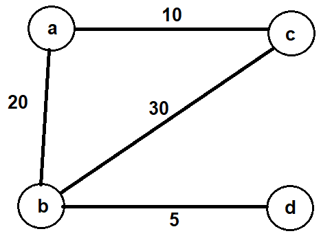

<p align="center">
   <h1>Dijkstra algorithm in C</h1>.
  <h6>by <i>FranciscoCharles</i></h6>
</p>
<p align="justify">

Este projeto é uma implementação do algoritmo Dijkstra para grafos em C usando lista ligadas para
a abstração da estrutura Grafo. O algoritmo encontra o custo minimo para um trajeto
partindo de um vertece inicial. Para usa-lo todos os vertices precisam ser acessiveis e todas as arestas devem ter um peso
maior que zero. 

</p>

# <a name=index>Table of contents</a>
 
- [**Como executar**](#run)
- [**Formato do arquivo de entrada**](#run)
- [**Versão**](#version)
- [**Licença**](#license)

# **<a name=run>Como executar</a>**  <h6>[back to indice](#index)</h6>
faça o download do projeto, entre na pasta `dijkstra/` e compile os arquivos. Se voce usa `gcc` utilize o seguinte comando:
```bash
gcc *.c *.h -o dijkstra
```
para executar e testar o funcionamento utilize:
```bash
.\dijkstra graph-example.txt s
```

Esse é o formato para chamar o programa, o mesmo aceita 2 parametros( **filename** e **start_vertex**) , que correspondem respectivamente ao nome do arquivo de entrada e qual o vertice inicial para o algoritmo utilizar.

# **<a name=file-format>Formato do arquivo de entrada</a>**  <h6>[voltar ao indice](#index)</h6>
O arquivo segue o seguinte formato e ordem de linhas:

| linha | formato | exemplo | descricao |
|-------|---------|---------| ----------|
| 1 | um unico inteiro | "5"  | representa a quantidade de vertices que o grafo vai ter|
| 2 ate (2 + N vertices) | uma string | "v1" | Da segunda linha em diante vem o rotulo que sera usado para cada vertice do grafo |

Após esseas primeiras linhas vem a seguir um segundo padrão para as arestas de cada vertice, como a seguir:

| formato | exemplo | descricao |
|---------|---------| ----------|
| rotulo aresta + **espaço** + numero de arestas | "v1 3" | o vertice atual a ser adicionado as arestas e sua respectiva quantidade de arestas |
| vertice de destino + **espaço** + peso da aresta | "v2 10" | O vertice de destino e o respectivo peso da aresta |

Usando o grafo abaixo:

<div align="center">
    
    <br>
    <h6>
        Figure 1 - grafo de exemplo.
    </h6>  
</div>

seu arquivo seria:
```text
4
a
b
c
d
a 2
b 20
c 10
b 3
a 20
c 30
d 5
c 2
a 10
b 30
d 1
b 5
```
# **<a name=version>Versão</a>**  <h6>[voltar ao indice](#index)</h6>
- versão atual do projeto: 0.0.1.

# **<a name=license>Licença</a>**  <h6>[voltar ao indice](#index)</h6>

Para mais informações sobre a licença deste projeto, leia o arquivo <a href="./LICENSE" title="go to license file">LICENSE</a>.

---
<p align="center">
    Copyright © 2021 <b>FranciscoCharles</b>
</p>